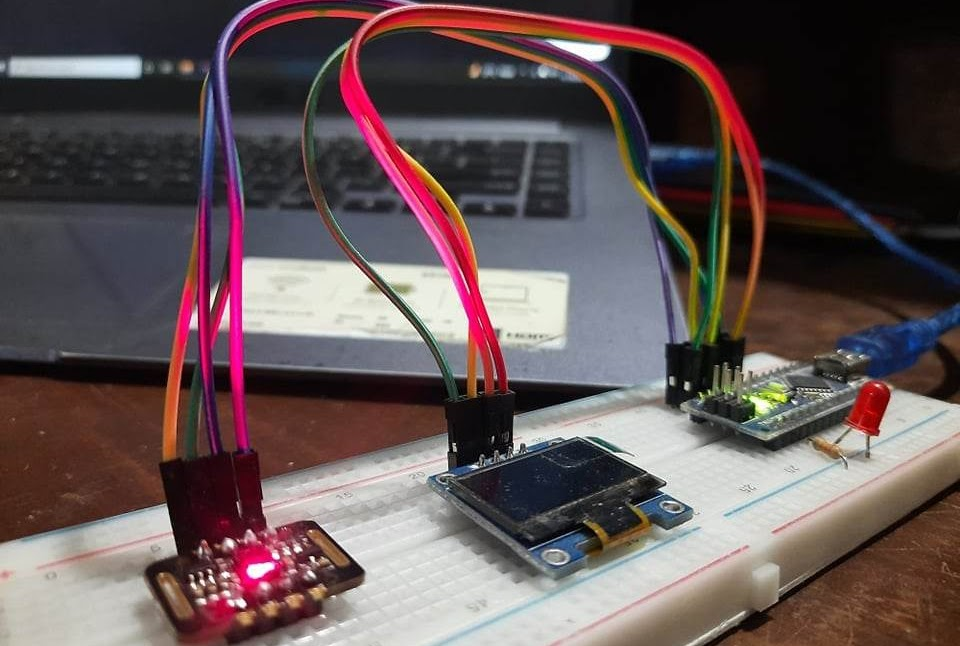

# Patient Monitoring Device (IoT)

This repository contains the code and documentation for our third-year, first-semester project at the Department of Electronics & Communication Engineering, Khulna University of Engineering & Technology. The project is a low-cost, durable COVID-19 detection system that continuously monitors vital signs such as heart rate, blood oxygen saturation, and temperature, with 24-hour remote monitoring capabilities.

  

## Project Overview

This project was developed as part of the **Electronics Project Design Lab (Course No: 3200)** under the supervision of **Dr. Mirza Mohd. Shahriar Masood**, Assistant Professor, ECE, KUET.

### Aim of the Project
1. Provide a low-cost, user-friendly, and durable COVID-19 detection system.
2. Measure heart rate, oxygen saturation, and temperature in real time.
3. Enable continuous patient monitoring via mobile applications.

### Features
- **Vital Sign Monitoring**: Accurate measurement of heart rate, oxygen saturation, and temperature.
- **Data Transmission**: Sends data wirelessly to a mobile app for remote access.
- **IoT Enabled**: 24-hour patient monitoring using the Blynk IoT platform.
- **Low Complexity**: Simple design ensures ease of use and maintenance.

## Hardware Components
- **Arduino Nano R3**: Microcontroller for processing sensor data.
- **MAX30102**: Pulse oximeter and heart rate sensor module.
- **DS18B20**: Digital temperature probe.
- **OLED Display (128x64)**: Visual display for vital sign readings.
- **ESP8266 ESP-01**: Wi-Fi transceiver module for IoT connectivity.

## Software Tools
- **Arduino IDE**: For programming the Arduino Nano.
- **Blynk IoT App**: Android app for monitoring vital signs remotely.

## Circuit Description
- The **MAX30102** sensor module measures heart rate and oxygen saturation.
- The **DS18B20** digital thermal probe records body temperature.
- Data is processed by the **Arduino Nano R3** and displayed on an **OLED screen**.
- The **ESP8266 ESP-01** transmits data to the Blynk app for real-time monitoring.

  

## Cost Analysis
| Component            | Quantity | Unit Price (Tk) | Total (Tk) |
|----------------------|----------|-----------------|------------|
| Arduino Nano R3      | 1        | 540             | 540        |
| MAX30102             | 1        | 200             | 200        |
| 128x64 OLED Display  | 1        | 550             | 550        |
| **Total**            |          |                 | **1290**   |

## Advantages
- Affordable and easy to assemble.
- Durable with no moving parts.
- Simple to integrate additional functionalities.
- Ideal for remote and continuous health monitoring.

## Future Improvements
- Integrate with a mobile app for neighborhood-level data collection and analysis.
- Enhance the system for better usability and scalability.

  

## Acknowledgment
This project was developed by **Abu Taher (Roll: 1709003)** and **Masud Rana (Roll: 1709053)** for academic purposes. We are grateful to our supervisor, Dr. Mirza Mohd. Shahriar Masood, for his guidance.

## License
This project is open-source and available under the [MIT License](LICENSE).
